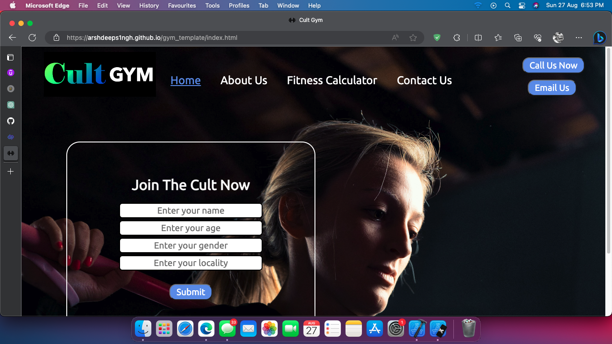
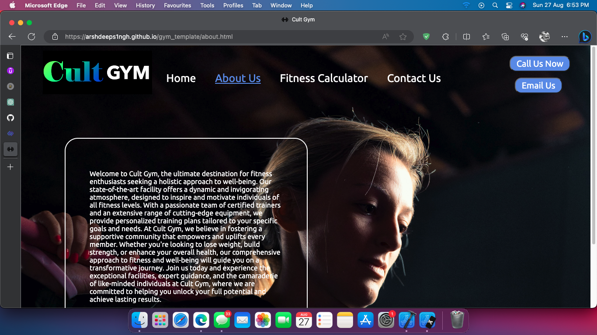
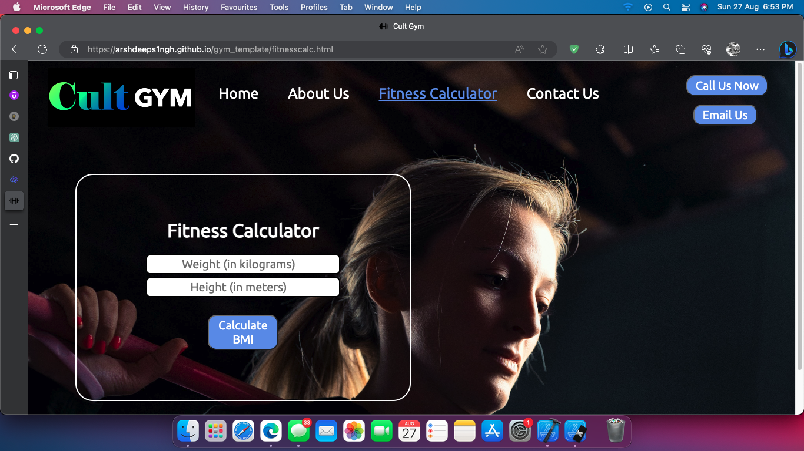

# Cult Gym Website

Welcome to the Cult Gym Website project! This comprehensive and fully functional web application is designed to showcase the features and capabilities of a modern fitness center. Built using HTML, CSS, and JavaScript, this project provides a responsive and visually appealing user interface that offers an immersive experience for visitors.

## Website Overview

Explore the Cult Gym Website to discover the various services, facilities, and programs offered by our modern fitness center. With its user-friendly design and interactive features, the website provides an engaging platform for users to learn more about our gym and its offerings.

## Preview

## Features

- Responsive design for optimal viewing on various devices.
- Information about gym services, facilities, and programs.
- Engaging user interface created with HTML, CSS, and JavaScript.

## Technologies Used

- HTML
- CSS
- JavaScript

## Screenshots

